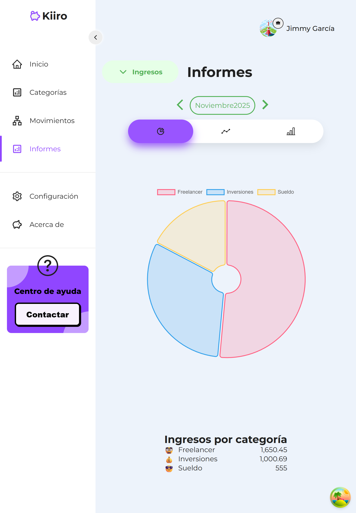
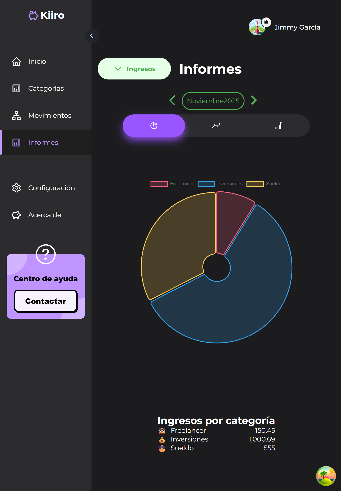

# 💸 Kiiro – Control de Gastos


Kiiro es una aplicación web moderna para **gestionar tus gastos personales**, desarrollada con **React + Supabase + Vite**.  
Permite llevar un control inteligente de tus ingresos y egresos, generar reportes dinámicos, visualizar gráficas y alternar entre modo claro y oscuro.

👉 **[Demo en línea](https://kiiro-control-gastos.netlify.app/)**  
🎬 **[Video demo](https://www.youtube.com/shorts/MrzQ0dgHOEM)**

---

## ✨ Características principales

- 📊 **Dashboard interactivo** con resumen de ingresos, egresos y saldo total.
- 📅 **Reportes filtrados por fecha** (mes, año o periodo personalizado).
- 🌗 **Modo claro y oscuro** con cambio dinámico de tema.
- 📈 **Gráficas dinámicas** generadas con Recharts.
- 🧾 **Gestión de categorías** y descripciones detalladas por movimiento.
- ☁️ **Integración con Supabase Storage** para guardar imágenes o recibos.
- 🔐 **Autenticación segura** con Supabase Auth.

---

## 🧱 Tecnologías utilizadas

| Categoría            | Tecnologías                                        |
| -------------------- | -------------------------------------------------- |
| **Frontend**         | React 18, Vite, React Hook Form, Styled Components |
| **Backend / BaaS**   | Supabase (Auth, Database, Storage, RPC Functions)  |
| **Gráficas**         | Recharts                                           |
| **Despliegue**       | Netlify                                            |
| **Estado global**    | Zustand                                            |
| **Diseño y estilos** | Styled Components / TailwindCSS                    |

---

## 📊 Capturas de pantalla

| Dashboard                                        | Modo oscuro                                      |
| ------------------------------------------------ | ------------------------------------------------ |
|  |  |

---

## 🧠 Sobre Kiiro

> “Kiiro” significa _amarillo_ en japonés 🌕 — un color asociado con la energía, el equilibrio y la prosperidad.
> Esta aplicación busca ayudarte a alcanzar ese equilibrio financiero con una interfaz limpia, moderna y eficiente.

## 👨‍💻 Autor

Desarrollado por **Jimmy García** basandome en el curso "Sistema para el control de gastos con ReactJs y PostgresSQL".

💼 [LinkedIn](https://www.linkedin.com/in/jimmyegc/)
🐙 [GitHub](https://github.com/jimmyegc)
📄 [Udemy](https://www.udemy.com/course/sistema-para-el-control-de-gastos-con-reactjs-y-postgresql/?couponCode=CERDYNREACT)

## 🚀 Próximas mejoras

- 📱 Adaptación completa para móviles.
- 🧩 Exportar reportes a PDF o Excel.
- 🔔 Recordatorios automáticos de gastos recurrentes.
- 💾 Sincronización con APIs de cuentas bancarias.

---

## ⚙️ Configuración local

1. **Clona el repositorio:**
   ```bash
   git clone https://github.com/jimmyegc/react-control-gastos-template.git
   cd react-control-gastos-template
   ```

````

2. **Instala dependencias:**

   ```bash
   npm install
   ```

3. **Crea un archivo `.env` en la raíz del proyecto:**

   ```bash
   VITE_APP_SUPABASE_URL=https://tuproyecto.supabase.co
   VITE_APP_SUPABASE_ANON_KEY=eyJhbGciOiJIUzI1NiIs...
   ```

   > ⚠️ Estas variables son **públicas por diseño**, ya que Supabase utiliza claves `anon` para el acceso desde el cliente.
   > No incluyas claves privadas (`service_role`) en el frontend.

4. **Ejecuta el entorno de desarrollo:**

   ```bash
   npm run dev
   ```

5. **Compila para producción:**

   ```bash
   npm run build
   ```

---

## 🌐 Despliegue en Netlify

Para evitar errores por el escaneo de secretos, crea un archivo `netlify.toml` en la raíz del proyecto con el siguiente contenido:

```toml
[build]
  command = "npm run build"
  publish = "dist"

[build.environment]
  SECRETS_SCAN_OMIT_KEYS = "VITE_APP_SUPABASE_ANON_KEY,VITE_APP_SUPABASE_URL"
```

Esto le indica a Netlify que ignore las variables de entorno públicas de Supabase durante el proceso de build.


````

## 📄 Licencia

Este proyecto está bajo la licencia **MIT**.
Consulta el archivo [LICENSE](./LICENSE) para más información.
